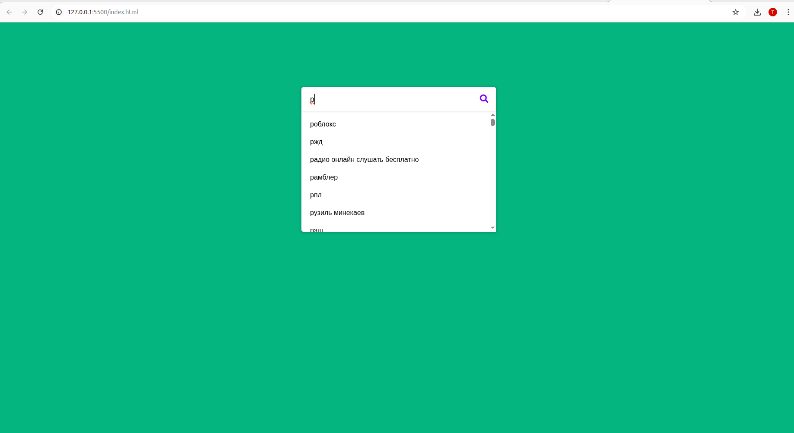

# 🔍 AutoSuggest — Автоподсказки для поисковой строки

Интерактивная поисковая строка с **автоподсказками** и быстрым переходом к результатам поиска Google.

---

## ✨ Возможности

- 🔎 Живой поиск с автодополнением
- ⚡ Фильтрация подсказок в реальном времени
- 🌐 Быстрый переход в Google по клику на иконку
- 📱 Полностью адаптивный интерфейс

---

## 🛠 Технологии

| Компонент   | Используется           |
|------------|------------------------|
| Разметка   | **HTML5**             |
| Стили      | **CSS3**              |
| Логика     | **Vanilla JavaScript** |
| Шрифты     | [Google Fonts](https://fonts.google.com/) |
| Иконки     | [Font Awesome](https://fontawesome.com/) |

---

## 📂 Структура проекта

```
SmartSearch/
├── index.html          # Основная страница
├── style.css           # Стили проекта
├── js/
│   ├── script.js       # Логика поиска и автоподсказок
│   └── suggestions.json # Файл с подсказками
└── README.md           # Описание проекта
```

---

## 🚀 Как запустить

1. Склонировать репозиторий:
   ```bash
   git clone https://github.com/<твоя_учетка>/smartsearch.git
   cd smartsearch
   ```

2. Убедиться, что структура файлов соответствует указанной выше.

3. Открыть `index.html` в браузере:


---

## 📌 Настройка подсказок

Все подсказки хранятся в файле:

```
js/suggestions.json
```

Формат:
```json
[
  "HTML",
  "CSS",
  "JavaScript",
  "React",
  "Node.js"
]
```

---

## 📸 Скриншот интерфейса




---
